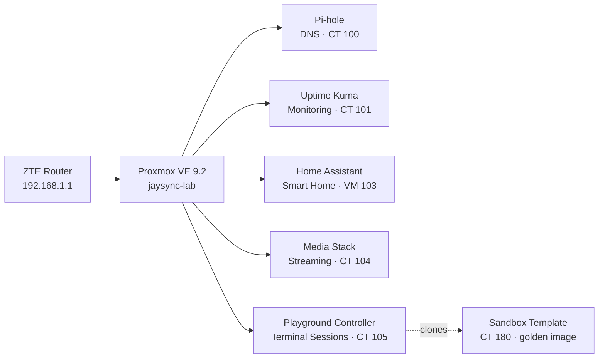

# 🖧 JaySync-Lab

> A personal homelab on **Proxmox VE** — network-wide DNS/ad-blocking, monitoring, home automation, a GPU-accelerated media stack, and a live in-browser terminal playground. Built and documented in the open.

This repository is the **single source of truth** for the lab: every service, network decision, and change is documented here as MDX, and the machine-readable [`infrastructure/inventory.yaml`](infrastructure/inventory.yaml) drives the public site. Push here → the docs site rebuilds itself. You never edit the site directly.

---

## 🗺️ The lab at a glance

| VMID | Service | Type | Role |
|:----:|:--------|:-----|:-----|
| `100` | Pi-hole | LXC | Network-wide DNS resolver & ad blocking |
| `101` | Uptime Kuma | LXC | Infrastructure monitoring ("the Watchman") |
| `103` | Home Assistant | VM | Smart home OS (HAOS) |
| `104` | Media Stack | LXC | Docker streaming stack, GPU passthrough |
| `105` | Playground Controller | LXC | Session controller for the terminal playground |
| `180` | Sandbox Template | LXC *(template)* | Golden image every playground session clones |

**Hardware:** HP ProDesk 400 G3 · Intel i5-6500 · 16 GB DDR4 · 512 GB SSD + 1 TB HDD
**Platform:** Proxmox VE 9.2.3 · Debian 13 (trixie) · unprivileged LXCs · Tailscale (bare-metal)

---

## 🔗 The three repositories

| Repo | What it is | Live |
|:-----|:-----------|:-----|
| **JaySync-Lab** *(here)* | Infrastructure docs + inventory — the source of truth | — |
| [jaysync-lab-site](https://github.com/JaySync-Lab/jaysync-lab-site) | Next.js + Fumadocs site that publishes these docs | [jaysynclab.com](https://jaysynclab.com) |
| [jaysync-lab-playground](https://github.com/JaySync-Lab/jaysync-lab-playground) | Disposable in-browser Linux terminal sessions | [jslnode.jaysynclab.com](https://jslnode.jaysynclab.com) |

---

## 📂 Repository layout

| Path | Purpose |
|:-----|:--------|
| `docs/` | All documentation, as MDX (`infrastructure/`, `networking/`, `security/`, `services/`) |
| `infrastructure/inventory.yaml` | Machine-readable hardware/service inventory — drives the site's homepage, architecture & services pages |
| `secrets/` | SOPS + age encrypted credentials — never fetched by the site build |
| `scripts/` | Repo tooling (`validate-docs.mjs`) |
| `.github/` | CI (`validate-and-dispatch.yml`) |
| `RULEBOOK.md` | How to author docs & edit the inventory |
| `MAINTENANCE.md` | Repo legend, IP map, update procedures |

## 🔄 How publishing works

Push a change under `docs/**` or to `infrastructure/inventory.yaml` on `main` →
CI validates it → notifies **jaysync-lab-site** → the site pulls a fresh copy,
builds, and deploys. If validation or the build fails, the live site is left
untouched. Full walkthrough in [`RULEBOOK.md`](RULEBOOK.md).

---

📖 **Read the docs:** [jaysynclab.com](https://jaysynclab.com)
